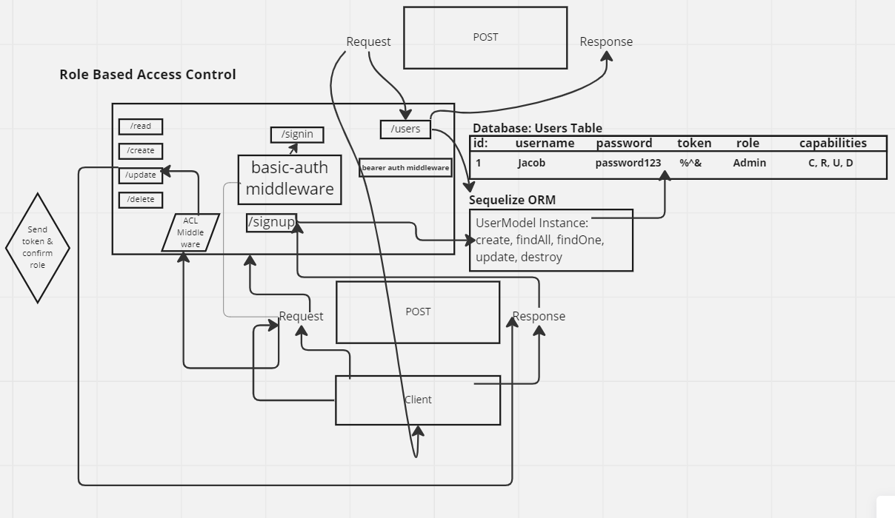

# LAB - Class 08

## Project: Access Control

### Author: Jacob Dang

### Problem Domain
Using two servers, the lab is meant to demonstrate two functioning APIs and how to implement them to become a fully functional, authenticated and authorized API Server. Routes that end up performing those actions in our API/Database need to be protected by both a valid user and that user’s permissions. Access controls are specified as:
- Regular users can READ
- Writers can READ and CREATE
- Editors can READ, CREATE, and UPDATE
- Administrators can READ, CREATE, UPDATE, and DELETE

### Links & Resources
{GitHub Actions} {URL}
{Deployed Database} {}

see '.env.sample'

### Features/Routes:
- Feature One: v1 Model Routes
    - CRUD Actions
- Feature Two: v2 Model Routes w/ Authentication
    - CRUD Actions

#### Tests
- How do you run tests?
    - npm test

## UML
